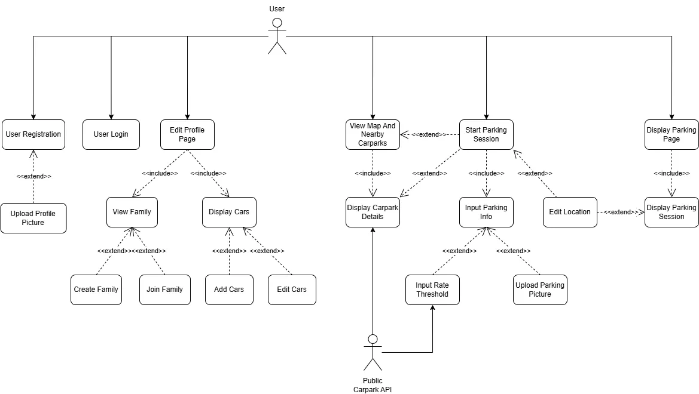
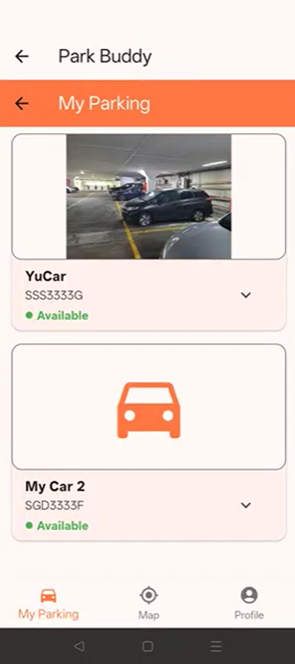
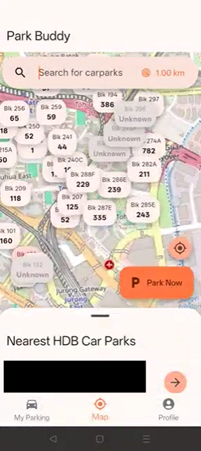
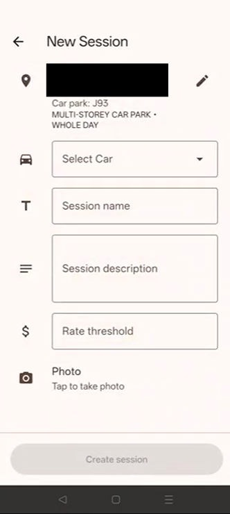

## Problem 
1. Users often struggle to find affordable parking options
2. It is difficult for users to track their parking expenses in real time
3. Users may forget where they parked after completing their activities
4. Lack of tools when a family needs to share a car to track its whereabouts and to keep other members updated

Existing apps do not fully address all these parking-related needs

About Park Buddy:
Combine these functions into one cohesive application
Introduce additional features to support families and companies that share cars

## Features

- Parking Management
  - Parking Tracking
  - Parking Rate Alerts
- Location tracking
- Group Car Management

- Carpark Finding
  - Carpark Finder
  - Live Map
- Distance Filtering
- Availability Updates  

  
